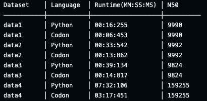

# Week 1 Report

**Name:** Jacob Smit

# Steps 
1. Setup GitHub repository as described in assignment description.
2. Clone the example repository and get the scripts running on the data.
3. Use AI to make broad changes porting Python to Codon.
4. Go through each error, fixing issues until the code runs as expected.
5. Create the evaluate script.

# Challenges
- Segmentation faults due to recursion:
- - ulimit was unable to be increased as recommended due to my device's hard stack size limit. 
- - GitHub runner was able to increase to this size, which allowed it to run data4 as expected.
- Porting code to Codon:
- - Ran into many issues with type hints.
- - Iteratively solved each error one at a time. 
- - I spent some time on the class attributes as I ran into errors with them.
- Struggled with bash scripting
- - AI was very helpful in translating what I wanted into a bash script.

# Results

The N50 values for Python and Codon implementations are shown below:

